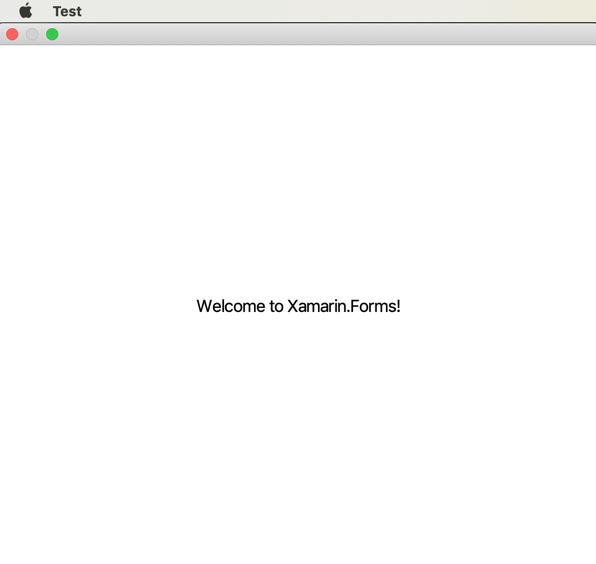

Simple cross-platform Xamarin.Forms application.

Created a blank Xamarin.Forms application for iOS and Android.

- TestAppMenu
- TestAppMenu.Android
- TestAppMenu.iOS

Created Mac Cocoa app TestAppMenu.MacOS.

All projects use these nuget packages:

- Xamarin.Forms, v4.1.0.581479
- Xamarin.Essentials, v1.2.0

When running TestAppMenu.MacOS (which is not yet a Xamarin.Forms app) normal menus appeared including AppMenu:Quit.

Convert TestAppMenu.MacOS to Xamarin.Forms app

See:

- https://devblogs.microsoft.com/xamarin/preview-bringing-macos-to-xamarin-forms/
- https://stackoverflow.com/questions/52415863/xamarin-forms-targeting-macos

Now running TestAppMenu.MacOS most of normal MacOS menubar is gone including AppMenu:Quit. Only item is **Test*, first item in AppMenu but mouse down does not display menu.



Have not yet deleted TestAppMenu.MacOS/Main.storyboard.

Have experimented with suggestion in this post [stackoverflow: Xamarin - XAML - top bar app menu
](https://stackoverflow.com/questions/51443019/xamarin-xaml-top-bar-app-menu) but haven't seen any effect.


Development Environment:
```
Visual Studio Community 2019 for Mac
Version 8.1.5 (build 9)
Installation UUID: b2583bc2-8f6d-4185-8a47-799c9278dca5
	GTK+ 2.24.23 (Raleigh theme)
	Xamarin.Mac 5.6.0.25 (d16-0 / 50f75273)
	Package version: 518010028

Apple Developer Tools
Xcode 10.3 (14492.2)
Build 10G8

Xamarin.Mac
Version: 5.10.0.157 (Visual Studio Community)
Hash: 6bd94753
Branch: d16-1
Build date: 2019-06-12 17:28:48-0400
```
